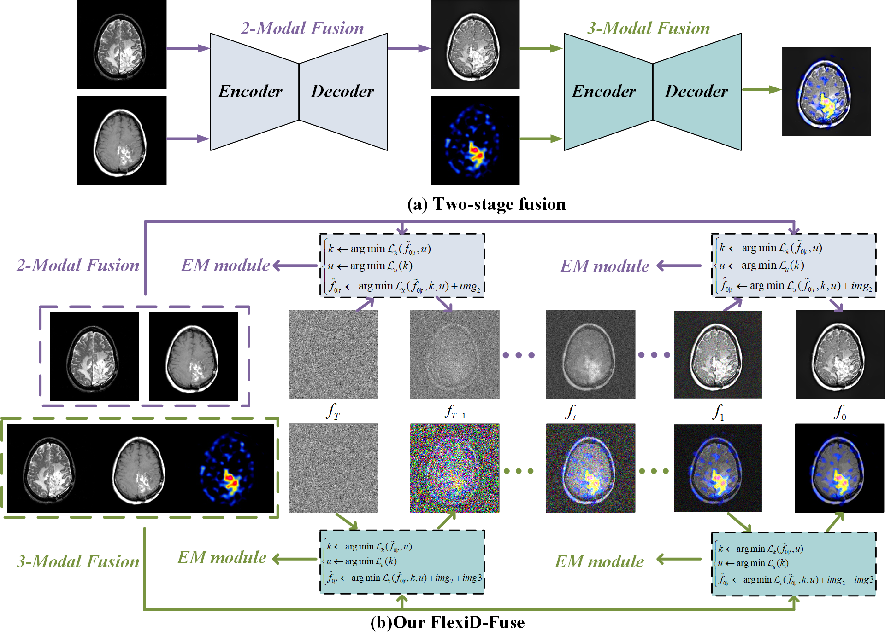

# FlexiD-Fuse<br>
## [ESWA25] FlexiD-Fuse: Flexible number of inputs multi-modal medical image fusion based on diffusion model
> **Abstract:**  Different modalities of medical images provide unique physiological and anatomical information for diseases. Multi-modal medical image fusion integrates useful information from different complementary medical images with different modalities, producing a fused image that comprehensively and objectively reflects lesion characteristics to assist doctors in clinical diagnosis. However, existing fusion methods can only handle a fixed number of modality inputs, such as accepting only two-modal or tri-modal inputs, and cannot directly process varying input quantities, which hinders their application in clinical settings. To tackle this issue, we introduce FlexiD-Fuse, a diffusion-based image fusion network designed to accommodate flexible quantities of input modalities. It can end-to-end process two-modal and tri-modal medical image fusion under the same weight. FlexiD-Fuse transforms the diffusion fusion problem, which supports only fixed-condition inputs, into a maximum likelihood estimation problem based on the diffusion process and hierarchical Bayesian modeling. By incorporating the Expectation-Maximization algorithm into the diffusion sampling iteration process, FlexiD-Fuse can generate high-quality fused images with cross-modal information from source images, independently of the number of input images. We compared the latest two-modal and tri-modal medical image fusion methods, tested them on Harvard datasets, and evaluated them using nine popular metrics. The experimental results show that our method achieves the best performance in medical image fusion with varying inputs. Meanwhile, we conducted extensive extension experiments on infrared and visible image fusion, multi-exposure image fusion, and multi-focus image fusion tasks with arbitrary numbers, and compared them with the perspective state-of-the-art (SOTA) methods. The results of the extension experiments consistently demonstrate the effectiveness and superiority of our method.

[Yushen Xu](https://scholar.google.com.hk/citations?user=NnD7vQYAAAAJ&hl=zh-CN), [Xiaosong Li](https://www.fosu.edu.cn/spoe/yanjiu/ssds/gxgc/11653.html)\*, [Yuchun Wang](https://scholar.google.com/citations?view_op=list_works&hl=zh-CN&user=xB57YWYAAAAJ), [Xiaoqi Cheng](https://www.fosu.edu.cn/mee/teachers/teachers-jxdzgcx/20469.html), [Huafeng Li](https://lhf12278.github.io/)

[](https://arxiv.org/abs/2509.09456) [](https://www.sciencedirect.com/science/article/abs/pii/S0957417425025126)


<p align="center">
  
</p>

## 📋 Table of Contents

- [Installation](#installation)
- [Quick Start](#quick-start)
- [Dataset Structure](#dataset-structure)
- [Citation](#citation)

## 🛠 Installation

### Prerequisites

- Python 3.8+
- CUDA-compatible GPU (recommended)
- PyTorch 1.8+

### Environment Setup

```bash
# Create virtual environment
conda create -n flexid-fuse python=3.8
conda activate flexid-fuse

# Install dependencies
pip install -r requirements.txt
```

## 🚀 Quick Start

```bash
# Run with custom weight
python sample.py --model_path ./weight/model.pth

# Run with custom dataset
python sample.py --test_folder path/to/your/dataset --save_dir path/to/output

# Specify GPU device
python sample.py --gpu 1
```
## 📁 Dataset Structure

### Standard Dataset Format

```
Dataset/
├── vi/           # Visible images
│   ├── image1.png
│   ├── image2.png
│   └── ...
├── ir/           # Infrared images
│   ├── image1.png
│   ├── image2.png
│   └── ...
└── 3/            # Third modality (optional)
    ├── image1.png
    ├── image2.png
    └── ...
```

### Medical Image Dataset Format

For medical imaging (T1, T1CE, T2):

```
Dataset/
├── vi/           # T1 images
├── ir/           # T1CE images  
└── 3/            # T2 images (optional)
```

# 📄 Citation

If you use this code in your research, please cite:

```bibtex
@article{XU2026128895,
title = {FlexiD-Fuse: Flexible number of inputs multi-modal medical image fusion based on diffusion model},
journal = {Expert Systems with Applications},
volume = {296},
pages = {128895},
year = {2026},
issn = {0957-4174},
doi = {https://doi.org/10.1016/j.eswa.2025.128895},
url = {https://www.sciencedirect.com/science/article/pii/S0957417425025126},
author = {Yushen Xu and Xiaosong Li and Yuchun Wang and Xiaoqi Cheng and Huafeng Li and Haishu Tan},
}
```


